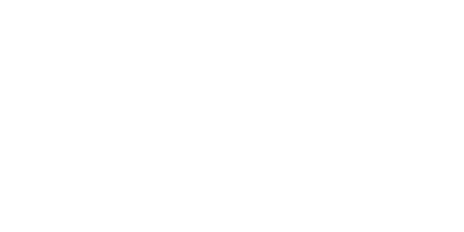

<div align="center">
    
</div>

<!--
# Churmant
**Churmant** *(cure-ment)*, is a *compiler* for **C** *language*, it's used for producing *Lua-like* code, but also run in a *blazingly* fast speed, when compared to others.
It also is very easy to maintain and read the header file, if you want to *contribute*. The reason why **Churmant** is its own *language*, is because its *syntax*
are not like **C** entirely, like `normal` *keyword* cannot be *stack* inside each other, for example.
-->

## Why Churmant

- **Lua-like Syntax:** Easy to read and write the code.
- **Stack's "Second Life:** Second life to handle the undetected error.
- **Safe Heap Allocation:** No more confusion about `malloc`, `realloc` or `calloc`.
- **Auto Garbage-Collection:** Automatically frees the heap-sided memories.
- **Reusing Leftovers:** Reuse leftovers from the garbage without any problems.

If you are wondering how would the *syntax* look like, here's an example of an *error* that would be caught on the *compiler*.

```chm
churmant_main
    int *a = null;
    *a = 0xDEAD; # line 3, cannot use unallocated pointer
churmant_mend
```

## Installation Steps

To *install* the **Churmant** *repository* and *compile* the *source* files, you need to download `chminit.exe` first, which you can *install* from this
[link](https://sourceforge.net/projects/churmant/files/chminit.exe/download). Then type `y` in every question. After the *installation*, you might want to *insert* an
*environment path* to the *repository*.
